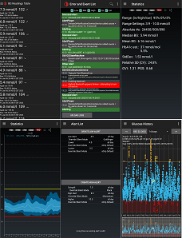

# xDrip
  
xDrip is an [open-source Android app](https://github.com/NightscoutFoundation/xDrip), developed, maintained and supported by volunteers, that you can use as a continuous glucose monitor (CGM).  
  
  
It lets you customize your alerts, follow (monitor) your child, parent or partner, perform statistical analysis, set targets, control and interact with different CGM devices, and a lot more.  
There is no financial incentive for any of the xDrip developers.  Each one of us either has diabetes or has a loved one who does.  We need and use xDrip ourselves.  
  
  
Documentation, instructions and guides here are provided to help you use xDrip.  
You need the advice of a competent medical professional to control your, or your loved one's, diabetes. This site provides no medical advice.  
  
  
### [Download & Installation](./docs/Installation_page.md)
### [Features](./docs/Features_page.md)
### [Settings](./docs/Settings.md)
### [Troubleshooting](./docs/Troubleshooting_page.md)
### [Frequently Asked Questions](./docs/FAQ_page.md)
   

---  
   
#### [Google Cloud Nightscout](./docs/Nightscout/GoogleCloud.md)
    
