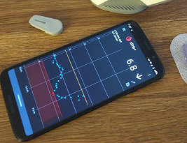

## xDrip Support 
  
  
  
You need the advice of a competent medical professional (endocrinologist) to control your diabetes. Neither xDrip nor this page provides that. There is no medical advice here.  

The instructions and guides here are provided to help you use xDrip.  
  
  
  
  **Installation**  
  
[Where can I download xDrip?](./docs/Download-xDrip.md)  

[xDrip version](./docs/xDrip-Version.md)  

[Update xDrip](./docs/Updates.md)  

[Backup database](./docs/Backup-Database.md)  

[Restore database](./docs/Restore-Database.md)  

[Discussions](https://github.com/NightscoutFoundation/xDrip/discussions)  
