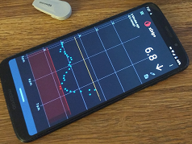

# xDrip Support  
  
   
  
xDrip is an Android app that turns your smartphone into a continuous glucose monitor receiver.   
The documentation, instructions and guides here are provided to help you use xDrip.  
  

You need the advice of a competent medical professional to control your, or your loved one's, diabetes. Neither xDrip nor this page provides any medical advice.  
  
   
  
### [Requirements](./docs/Requirements_page.md)  
  
### [Installation](./docs/Installation_page.md)  
  
### [Features](./docs/Features_page.md)    
  
### [Dexcom](./docs/Dexcom_page.md)  

### [Troubleshooting](./docs/Troubleshooting_page.md)  
  
### [Frequenty Asked Questions](./docs/FAQ_page.md)  
  
### [Some Release Notes](./docs/ReleaseNotes.md)  
  
   
  
---  
  
### [Bugs](./docs/Bugs.md)  
### [Feature Resuests](./docs/Features.md)  
  
   
  
---  
  
### [Index (search)](./Search_Index.md)  
  
