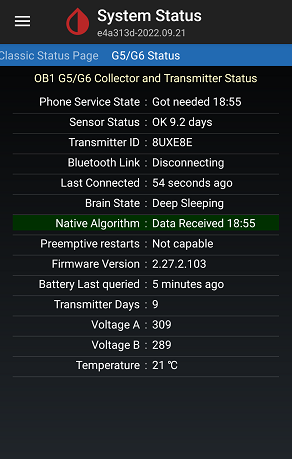
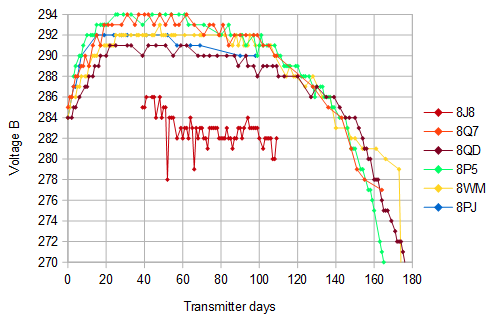

## Transmitter Battery condition
[xDrip](../README.md) >> [Features](./Features_page) >> [Dexcom](./Dexcom_page) >> Transmitter Battery  
  
G6 Battery  
  
It's not a good idea to have a replacement transmitter stashed.  The battery ages even if you are not using the transmitter.  In fact, if you look at the transmitter box, you can see two different dates printed on it.  The first date is the date of manufacture.  The second date is the date the manufacturer considers the transmitter to be too old.  That's because of the expected lifetime of the battery.  
  
You can see 2 voltages (Voltage A and Voltage B) reported on the G5/G6 status page.  
  
  
You can see the values for the past 9 days in the logs.  You can tap on the magnifying glass symbol to search and search for volt.  That only shows the battery voltage logs.   

The voltages vary from transmitter to transmitter.  But, what is consistent, for all transmitters, is that when the battery is about to fail, voltage B starts dropping on a continuous steep trajectory.  
The following image shows voltage B for six different G6 transmitters.  
  
