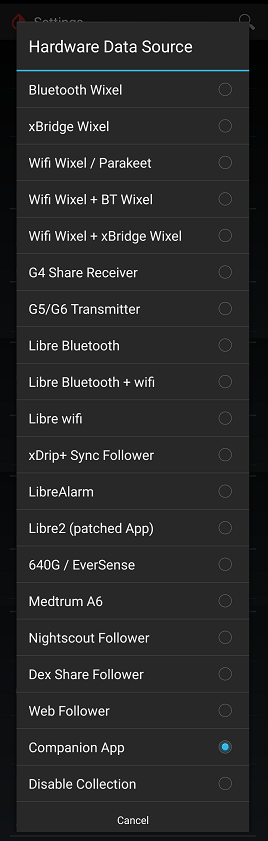

## Companion App
[xDrip](../../README.md) >> [Features](../Features_page.md) >> [Follow](../Follow_page.md) >> Companion App  
  
xDrip can get readings from notifications issued by another app.  
For example, if you have CamAPS installed and operational, you can have xDrip on the same phone show readings from CamAPS.  
Similarly, if you have a Dexcom app installed collecting from a transmitter, you can use the Companion App feature to receive readings from the Dexcom app.  
  
This feature does not require internet access.  
  
To use it, enable Companion App on the Hardware Data Source page.  
  
  
  
