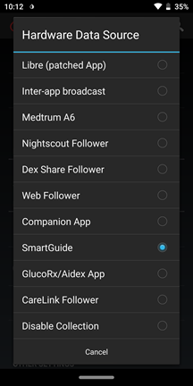
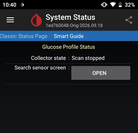
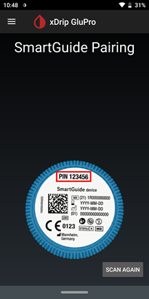
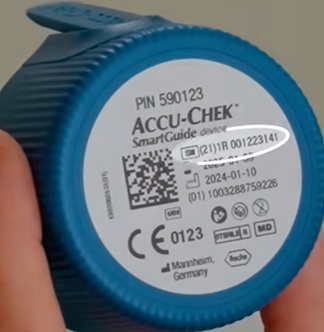
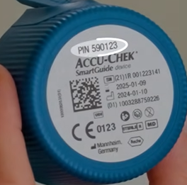

---  
title: Accu-Chek SmartGuide  
description: "Guide to using xDrip to directly collect glucose data from Accu-Chek SmartGuide sensors with setup tips."  
---  
  
# Accu-Chek SmartGuide  
[xDrip](../../) >> [Features](../Features_page.md) >> SmartGuide  
  
This guide explains how to use xDrip to collect directly from Accu-Chek SmartGuide.  
   
  
---  
  
#### **Starting (inserting) the sensor**  
  
Follow the instructions from the sensor manufacturer for inserting the sensor.  
Keep the twist cap as you will need it later.  
   
  
---  
  
#### **Establishing connectivity**  
  
1- Only one app can collect from the transmitter at any time.  If you have installed the official app or any other app that collects data from the transmitter, uninstall it.  
  
2- Ensure xDrip is updated to at least the current stable release.  
  
3- Select "Settings" > "Hardware data source" > "SmartGuide"  
  
  
4- From the main menu, tap on "System status".  Swipe left/right until you are on the SmartGuide status page.  
  
  
5- Tap on "Open".  You will be taken to the pairing page.  
  
  
6- Tap on "Scan again".  
  
7- If you are presented with a list of devices to choose from, look at your sensor twist cap and find the serial number.  Tap on the one with that same serial number.  
  
  
8- When a pair request pops up, enter the 6-digit pin from the twist cap and approve pairing.  
  
  
  
