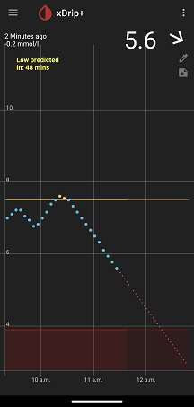
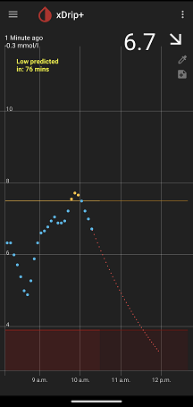

## Forecast Low alert
[xDrip](../../README.md) >> [Features](../Features_page.md) >> [xDrip Alerts](../Alerts_page.md) >> Forecast Low alert  
  
Glucose level alerts notify you when your glucose is too low or too high, but the trend is also crucial. For example, if your glucose level is at 6 (108) with a flat trend, you might not need an alert. However, if your glucose is at the same level but dropping rapidly, an alert could be essential.  
  
While the Fast Falling Alert notifies you if glucose is dropping very quickly, it might not be useful if you’re aiming for a rapid drop in glucose due to high levels. Thus, neither alert may fully meet your needs on its own, making a combination of alerts more effective.  
  
The Forecast Low Alert provides that combination. It uses your current glucose level and trend to predict how low your glucose may be in the near future and alerts you if the predicted level drops below a specified threshold.  
  
To manage the Forecast Low Alert, go to `Settings` &#8722;> `Alarms and Alerts` &#8722;> `Extra Alerts`.   
  
  
The alert will trigger if the extrapolated value is projected to fall below your low threshold within the time specified under "Alarm at forecasted low mins".  
  
Note that the Forecast Low Alert does not consider factors like insulin, carbs, or exercise. It uses your current glucose value and recent readings to calculate the trend and predict future levels.  
  
If the trend is linear, the alert extends the line to determine when it will cross the threshold. If the trend is curved, it performs a polynomial extrapolation to estimate when the curve will cross the threshold.  
  
  
  
