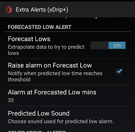

## Forecast Low alert
[xDrip](../../README.md) >> [Features](../Features_page.md) >> [xDrip Alerts](../Alerts_page.md) >> Forecast Low alert  
  
Glucose level alerts, the main alerts, alert you when your glucose is low or high.  
But, it may not be just your current value that matters, but also the trend.  
The Forecast Low alert considers your current level as well as the trend to extrapolate and predict how low you may be in a certain amount time and alert you if the prediction is below a threshold.  

The following image shows the Extra Alerts page, where you can control the Forecast Low alert, at `Settings` &#8722;> `Alarms and Alerts` &#8722;> `Extra Alerts`.  
  
  
The alert will trigger if the extrapolated value drops below your low value in  less than the time (in minutes) specified under `Alarm at forecasted low mins`.  
  
The forecast low alert does not take into account insulin or carbs or exercise etc.  
It takes into account the current glucose value and a few of the recent readings to calculate the trend and predict the next few readings.  
  
