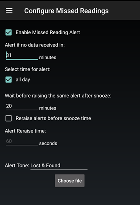

## Missed Reading Alert
[xDrip](../../) >> [Features](../Features_page.md) >> [xDrip Alerts](../Alerts_page.md) >> Missed Reading alert  
  
xDrip can alert you if you have had no readings for a certain amount of time.  It is called the missed reading alert.  
  
  
To enable it, go to `Settings` &#8722;> `Alarms and Alerts` &#8722;> `Missed reading Alert`.  
  
This alert uses the same setting for override do not disturb from other alerts at `Settings` &#8722;> `Alarms and Alerts` &#8722;> `Other Alerts`.  That setting is at the very bottom of that page.  
   

---  
  
Unfortunately, this alert does not use the volume profile.  At least, not yet.  Therefore, if you lower your phone's volume, this alert will play at that lower volume.  
I hope to change this in the near future such that this alert would use the chosen volume profile.  

  
