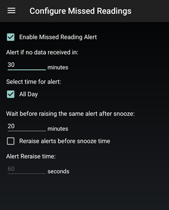

## Missed Reading Alert
[xDrip](../../README.md) >> [Features](../Features_page.md) >> [xDrip Alerts](../Alerts_page.md) >> Missed Reading alert  
  
xDrip can alert you if you have had no readings for a certain amount of time.  It is called the missed reading alert.  
  
  
To enable it, go to `Settings` &#8722;> `Alarms and Alerts` &#8722;> `Missed reading Alert`.  
  
This alert uses the same settings for override do not disturb or the sound file from other alerts at `Settings` &#8722;> `Alarms and Alerts` &#8722;> `Other Alerts`.  Those two settings are at the very bottom of that page.  
  
  
  
