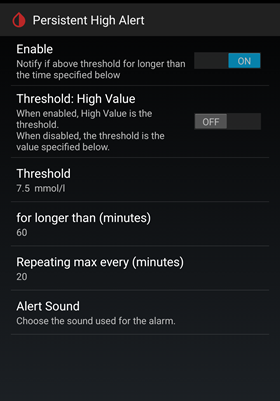

## Persistent High alert
[xDrip](../../README.md) >> [Features](../Features_page.md) >> [xDrip Alerts](../Alerts_page.md) >> Persistent High alert  
  
Glucose level alerts notify you when your glucose is either low or high. However, it's not just your current glucose level that matters; the duration for which your glucose has been high is also important.  
  
For instance, if you expect a high glucose level after meals but anticipate that it should only last a short while, you need to be informed if it persists longer. This is where the Persistent High Alert comes in. It notifies you if your glucose level has been above a specified threshold for longer than a set amount of time.  
  
The Persistent High Alert monitors both your current glucose level and previous levels to determine how long you have been persistently high and alerts you if necessary.  
  
The following image shows the Extra Alerts page, where you can adjust the Persistent High Alert settings. Navigate to `Settings` &#8722;> `Alarms and Alerts` &#8722;> `Extra Alerts`.    
  
  
The alert is triggered if the glucose level remains above the threshold (your high level) continuously for a period longer than the duration specified under "For longer than (minutes)".  
  
  
