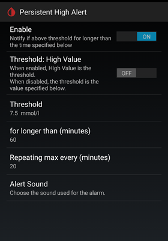

## Persistent High alert
[xDrip](../../) >> [Features](../Features_page.md) >> [xDrip Alerts](../Alerts_page.md) >> Persistent High alert  
  
Glucose level alerts notify you when your glucose is either too low or too high. However, it’s not just the current glucose level that matters—how long your glucose remains high is equally important.  
  
For instance, after meals, you may expect your glucose level to rise temporarily. However, if it stays high for an extended period, you need to be notified. This is where the Persistent High Alert feature comes into play. It alerts you if your glucose level remains above a specified threshold for longer than a set duration.   
  
The Persistent High Alert monitors both your current and past glucose levels to determine how long your glucose has been persistently high. If necessary, it triggers an alert to help you take timely action.   
  
The image below shows the Persistent High Alert page, where you can configure the settings. To access it, navigate to: `Settings` &#8722;> `Alarms and Alerts` &#8722;> `Extra Alerts` &#8722;> `Persistent High Alert`.      
  
  
The alert is triggered when your glucose level stays above the threshold continuously for longer than the duration specified under “For longer than (minutes).”    
   

---  
  
#### **Threshold**  
You can configure the threshold for your Persistent High Alert in one of two ways:  
1- **Use High Value:**  Enable the `Threshold: High Value` option to use the value set in `Settings` &#8722;> `Glucose Units` &#8722;> `High Value` as the threshold.  
2-  **Specify a Custom Threshold:**  Disable the `Threshold: High Value` option to set a custom threshold for the Persistent High Alert, independent of your High Value setting.  

  
