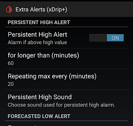

## Persistent High alert
[xDrip](../../README.md) >> [Features](../Features_page.md) >> [xDrip Alerts](../Alerts_page.md) >> Persistent High alert  
  
Glucose level alerts, the main alerts, alert you when your glucose is low or high.  
But, it may not be just your current value that matters, but also how long you have been high.  
  
Let's say you expect a high after meals.  But, you expect them to last only a short while.  
But, if they last longer, you may need to know.  That's what the persistent high alert is for.  
It alerts you if your glucose has been greater than a threshold longer than a specified amount of time.  
  
The Persistent High alert considers your current level as well as your previous levels to calculate how long you have been persistently high and alert you if needed.  
  
The following image shows the Extra Alerts page, where you can control the Persistent High alert, at `Settings` &#8722;> `Alarms and Alerts` &#8722;> `Extra Alerts`.  
  
  
The alert will trigger if the glucose level remains over the threshold (your High level) consistently for a period longer than the time (in minutes) specified under `For longer than (minutes)`.  
  
  
