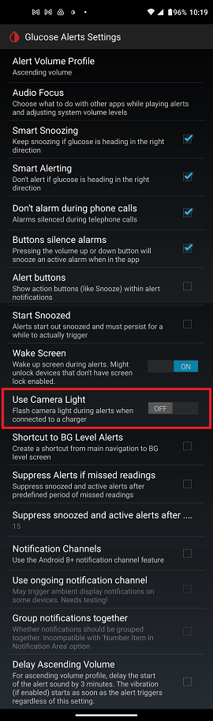

## Turn light on for alert
[xDrip](../README.md) >> [Features](./Features_page.md) >> [xDrip Alerts](./Alerts_page.md) >> Turn a light on for an alert  
  
xDrip can strobe the phone flash for an alert while the phone is being charged.  
You can enable the feature at Settings &#8722;> Alarms and Alerts &#8722;> Glucose Alert Settings &#8722;> Use Camera Light as shown below.  
  
