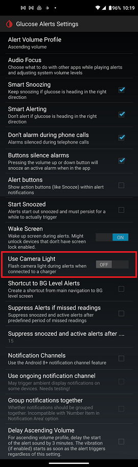

## Turn light on for alert
[xDrip](../../README.md) >> [Features](../Features_page.md) >> [xDrip Alerts](../Alerts_page.md) >> Turn a light on for an alert  
  
xDrip can activate the phone's flashlight to strobe for an alert while the phone is charging.  
To enable this feature, navigate to:  
`Settings` &#8722;> `Alarms and Alerts` &#8722;> `Glucose Alert Settings` &#8722;> `Use Camera Light`, as shown below.  
  

  
