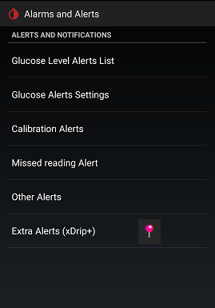

# xDrip Alerts  
[xDrip](../README.md) >> [Features](./Features_page.md) >> [xDrip Alerts](./Alerts_page.md)  
  
  
  
|  Alert |  Volume |  Sound file |  Override Silent Mode |  
| ----- | ------ | ---------- | -------------------- |  
| Glucose level | Volume profile | Can choose | &#10004; |  
| Calibration | Ring & notification | Can choose | &#10004; |  
| Missed Reading | Ring & notification | "Other Alerts" \* | "Other Alerts" \* | 
| Other Alerts | Ring & notification | Can choose | &#10004; |  
| Persistent High | Ring & notification | Can choose | "Other Alerts" \* |  
| Forecast Lows | Ring & notification | Can choose | "Other Alerts" \* |

 \* Uses the same setting selected for "Other Alerts".  

  
#### [Glucose Level Alert List](./Glucose-level-alerts.md)
#### [Volume Profiles](./Volume-profiles.md)  
#### [Ascending volume profile - alert too loud - quiet](./Ascending-volume-profile.md)
#### [Snooze](./Snooze.md)
#### [Notification Channels](./Notification-channels.md)
#### [Audio Focus - alert raises music volume](./AudioFocus.md)
#### [Custom Alert Sound](./Custom-Alert-Sound.md)
#### [Alert makes no sound](./Silent-alert.md)
