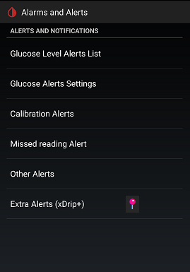

# xDrip Alerts  
[xDrip](../README.md) >> [Features](./Features_page.md) >> xDrip Alerts  
  
To access the alerts page, tap on the top left menu button from the main screen and select "Settings &#8722;> Alarms and Alerts".  
  
  
   
  
|  Alert |  Volume |  Sound file |  Override Silent Mode |  
| :----: | :-----: | :---------: | :-------------------: |  
| Glucose level | Volume profile | Can choose | Can enable |  
| Calibration | Ring & notification | Can choose | Can enable |  
| Missed Reading | Ring & notification | "Other Alerts" \* | "Other Alerts" \* | 
| Other Alerts | Ring & notification | Can choose | Can enable |  
| Persistent High 📍 | Ring & notification | Can choose | "Other Alerts" \* |  
| Forecast Lows 📍 | Ring & notification | Can choose | "Other Alerts" \* |  
| Sensor Expiry 📍 | No sound | No sound | No sound |  
  
 \* Uses the same setting selected for "Other Alerts".  
    
  
#### [Glucose Level Alert List](./Glucose-level-alerts.md)
#### [Volume Profiles](./Volume-profiles.md)  
#### [Ascending volume profile - alert too loud - quiet](./Ascending-volume-profile.md)
#### [Snooze](./Snooze.md)
#### [Notification Channels](./Notification-channels.md)
#### [Audio Focus - alert raises music volume](./AudioFocus.md)
#### [Custom Alert Sound](./Custom-Alert-Sound.md)
#### [Strobe light](./Alerts/TurnLightOn.md)
  
#### [Alert makes no sound](./Silent-alert.md)
#### [Alert blasts my ears on headphone](./Force-Speaker.md)
#### [Missed Readings alert not repeating](./MissedSignalAlert.md)
