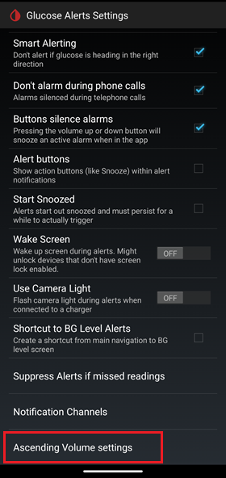

## Ascending Volume Profile  
[xDrip](../README.md) >> [Features](./Features_page.md) >> [xDrip Alerts](./Alerts_page.md) >> xDrip Ascending Volume Profile  
  
Try the ascending volume profile if you haven't already.  
When the xDrip alarm triggers, it starts silent or at low volume (depending on a setting).  Then, the alarm plays at 1-minute intervals.  Every time it plays, the volume increases a little bit.  Eventually, it plays it at the high or medium volume (depending on a setting).  
  
To enable it, go to  
`Settings` &#8722;> `Alarms and Alerts` &#8722;> `Glucose Alert Settings` &#8722;> `Alert Volume Profile`,  
and choose `Ascending Volume Profile`.  

If you cannot hear your alarm when you are in a noisy environment, this can solve the problem because it will eventually play the alarm at a higher volume.  

If your alarm wakes up or annoys others around you, this can solve the problem because it starts playing at a very low volume and you can snooze it before the volume increases.  You will have several minutes before the volume is raised to its target.  

   

The following graph shows the ascending volume versus time for an alert that has triggered at time 0.  
  
  
  
The vibration is independent of the delay ascending setting.  You can enable vibration for each one of your Glucose Level alerts separately on the corresponding "Edit alert" page as shown below.  
  
  
The medium and high volumes correspond to the values of 0.7 and 1 in the graph.  
As soon as the alert is snoozed, both sound and vibration terminate.  
   

---  

#### **Delay Ascending Volume & Ascend to Medium**    
You can reach the `Delay Ascending Volume` and `Ascend to medium` settings at:  
`Settings` &#8722;> `Alarms and Alerts` &#8722;> `Glucose Alerts Settings` &#8722;> `Ascending Volume settings`  
  
  
  
