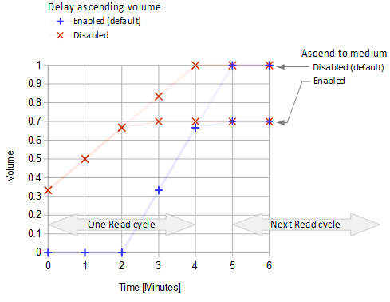

## Ascending Volume Profile  
[xDrip](../README.md) >> [Features](./Features_page.md) >> [xDrip Alerts](./Alerts_page.md) >> Ascending Volume Profile  
  
Try the ascending volume profile if you haven't already.  
When the alarm triggers, it starts silent or at low volume depending on the setting.  Then, the alarm plays at 1-minute intervals.  Every time it plays, the volume increases a little bit.  Eventually, it plays it at the max. volume.  
  
To enable it, go to  
Settings &#8722;> Alarms and Alerts &#8722;> Glucose Alert Settings &#8722;> Alert Volume Profile,  
and choose "Ascending Volume Profile".  

If you cannot hear your alarm when you are in a noisy environment, this can solve the problem because it will eventually play the alarm at the very high volume.  

If your alarm wakes up or annoys others around you, this can solve the problem because it starts playing at a very low volume and you can snooze it before the volume increases.  You will have several minutes before the volume is raised to maximum.  

   

The following graph shows the ascending volume versus time.  
  
  
  
\* The volume reaches maximum (100%) on the next reading if the next reading does not trigger another alert or does not result in the current alert ending.  The sound and vibration end as soon as the alert is snoozed.  
  
The "Delay Ascending Volume" setting is on the following page.  
Settings &#8722;> Alarms and Alerts &#8722;> Glucose Alerts Settings  
  
  
