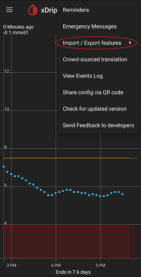

  
# Backup
[xDrip](../) >> [Features](./Features_page.md) >> xDrip Backup  
  
You can access xDrip's backup functions from the top right menu button under `Import /Export featurets`.  
  
  
#### [Google Drive backup](./GoogleDriveBackup.md)
#### [Legacy database backup](./Backup-Database.md)
#### [Legacy database restore](./Restore-Database.md)
#### [Copy settings](./CopySettings.md)
#### [Transfer to a new phone](./New-Phone.md)
  
