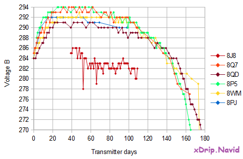

## Battery condition  
  
You can see 2 voltages (Voltage A and Voltage B) reported on the G5/G6 status page.  
  
It's a good idea to keep track of voltage B as you use the transmitter.  For example, if you record the value every other day, you will have enough to judge how the battery is doing any time.  Without such a record, you can only see the current value (and 3 or 4 more readings in the logs), which is not as useful.  

The voltages vary from transmitter to transmitter.  But, what is consistent, for all transmitters, is that when the battery is about to fail, voltage B starts dropping on a continuous trajectory.  That's why it's a good idea to keep track of voltage B.  

The following image shows voltage B for five different G6 transmitters.  
  
