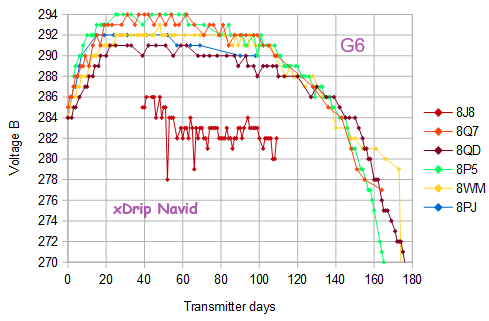
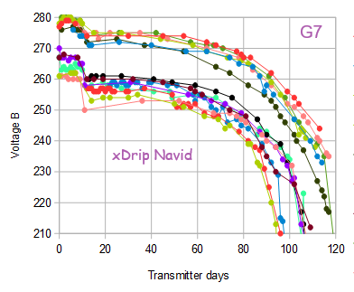

## Transmitter Battery condition
[xDrip](../README.md) >> [Features](./Features_page.md) >> [Dexcom](./Dexcom_page.md) >> Transmitter Battery  
  
It's not a good idea to have a replacement transmitter stashed.  The battery ages even if you are not using it.  In fact, if you look at the transmitter (or G7/One+) box, you can see two different dates printed on it.  The first date is the date of manufacture.  The second date is the date the manufacturer considers the device to be too old.  That's because of the expected lifetime of the battery.  
  
You can see 2 voltages (Voltage A and Voltage B) reported on the xDrip G5/G6 status page.  
  
  
The voltages vary from transmitter to transmitter.  But, what is consistent, for all transmitters, is that when the battery is about to fail, voltage B starts dropping on a continuous steep trajectory.  
You can see how your transmitter voltages have been changing as explained [here](./Dexcom/BatteryVoltageLogs.md).  
  
The following image shows voltage B for six different G6 transmitters.  
  

The following image shows voltage B for 14 different G7 devices.  
  
  
You can see how your transmitter voltages have been changing as explained [here](./Dexcom/BatteryVoltageLogs.md).  
  
