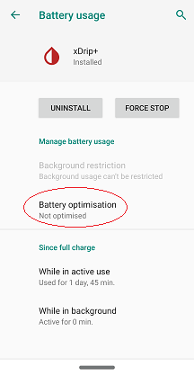

## xDrip Battery Optimization
[xDrip](../README.md) >> [Download & Installation](./Installation_page.md) >> xDrip Battery optimization  
  
If you use xDrip as your collector, the app that receives readings from the sensor, you need to disable battery optimization for xDrip on your phone.  
  
Generally, this is at Android settings &#8722;> Apps &#8722;> xDrip+ &#8722;> Advanced &#8722;> Battery.  
  
  
Depending on device and Android version, there may be minor differences in exactly where the setting may be or what it is called.  
  
For example, on Pixel, you actually need to set xDrip battery usage to unrestricted to accomplish the same objective.  
  
