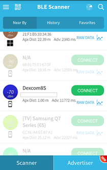

# How strong is the transmitter signal?
[xDrip](../) >> [Features](Features_page.md) >> [Dexcom](./Dexcom_page.md) >> Scanner  
  
If the transmitter is not transmitting, you won’t be able to use it, regardless of how you set up xDrip.  Sometimes, it may be necessary to verify whether the transmitter is functioning. You can use a Bluetooth scanner for this purpose. It’s best to use a scanner that scans continuously rather than one that stops after a minute or so. At the time of writing this, the following app meets that requirement:  
[BLE Scanner](https://play.google.com/store/apps/details?id=com.macdom.ble.blescanner)  

Install the app on any Android phone. It doesn’t need to be the same phone that has xDrip installed. Be cautious of on-screen ads.  
  
Run the app and grant permission when requested. Ensure the transmitter is in the same room as the scanner.  
The app will start scanning for available Bluetooth devices and will create a list.  Scroll through the list to locate the transmitter.  
  
For a G6 or Dexcom One, look for a device named Dexcom\*\*, where \*\* are the last two characters of the transmitter’s serial number.  
  
For a G7 or One+, look for a device named DXCM\*\* or DX02\*\*.  The last two characters are random and unrelated to the pairing code.  
  
Beside the device name, you will see a negative number. Write this number down.  
You may need to wait up to 5 minutes for the listing to appear.   If the listing is not clear and bold, wait for the next reading cycle. Record the value once it appears in bold.   
  
  
If the listing never appears, the transmitter is not transmitting.  
  
If you see the listing, report it, as well as the value beside it, to the person who asked you for the scan.  
If you see the listing, report it and the value beside it to the person who requested the scan.  
  
Once you’re finished, you can uninstall the scanner app.  
  
