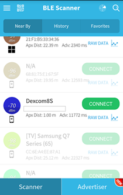

## How strong is the transmitter signal?
[xDrip](../README.md) >> [Features](Features_page) >> [Dexcom](../Dexcom_page) >> [Scanner](./Bluetooth-Scanner)  
  
If the transmitter is not transmitting, you will not be able to use it no matter how you set up xDrip!  
Sometimes, it may be necessary to verify that the transmitter is functioning.  You can use a Bluetooth scanner for that.  It's best to use a scanner that scans continuously as opposed to one that scans only for a minute or so and then stops.  At the time of writing this page, the following app met that requirement.  

[BLE Scanner](https://play.google.com/store/apps/details?id=com.macdom.ble.blescanner)  

Install the app, on any Android phone.  It doesn't have to be the same phone that has xDrip on it.  Be careful with the on-screen ads.  
Run the app and give permission when requested.  Have the transmitter in the same room as the scanner.  
It will start scanning for available Bluetooth devices it can find.  It will create a list.  You can scroll up and down to see all on the list.  
Look for a device named Dexcom**, where ** are the last two characters of the transmitter serial number.  Beside it, you will see a negative number.  Write that down.  
You may need to wait up to 5 minutes to see the listing.  If the listing is not clear and bold, you need to wait again for the next reading cycle.  Write down the value when it is bold.  
  

If the listing never shows up, the transmitter is not transmitting.  
If you see the listing, report it, as well as the value beside it, to the person who asked you for the scan.  

You can uninstall the scanner after you are done.  
