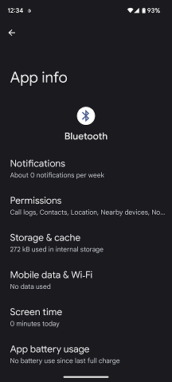
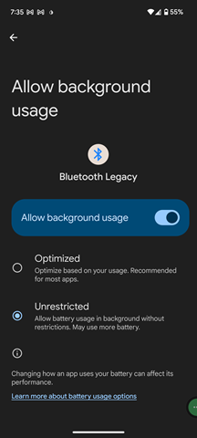

## Bluetooth Battery Optimization
[xDrip](../README.md) >> [Download & Installation](./Installation_page.md) >> xDrip Bluetooth Battery optimization  
  
If you use xDrip as your collector—the app that receives readings from the sensor—you need to disable battery optimization for Bluetooth on your phone.  
  
Go to Android Settings &#8722;> Apps.  
You may need to tap on "See all apps" to view the full list.  
At the top, select the 3-dot menu and choose “Show system.”  Now, search for Bluetooth and tap on it. You should see something like this:  
  
  
Tap on App battery usage. Depending on your phone's manufacturer, the options may vary. The goal is to disable battery optimization for Bluetooth.   
On some phones, it may be labeled as “Unrestricted.”  
For some Android versions, the app may be referred to as Legacy Bluetooth.  
Disable battery optimization or set battery usage to "Unrestricted".  
  
  
