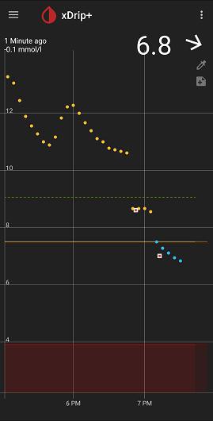

## Calibrate G6 after a restart  
  
You should use an xDrip release not older than the current stable release.  You can see the update procedure [here](./Updates.md).  

Your readings will start after the warm up and will be significantly higher than the correct values.  Please don't take insulin to remedy that.  If you have a closed-loop system, please open the loop.  
   - To calibrate, tap on "Add Calibration" from the top left menu button on the main screen.  
   - If you calibrate to correct the large error in one shot, you may get a confused calibration error, which stops readings and may never come back.  
   To avoid that, you should limit the correction to 20% of the reading, and delay the second calibration to 25 minutes after the first.  
   For example, if the readings are at 10mmol/L (180mg/dL) and your glucose meter shows 6.0 (108), you should calibrate to 8.0 instead of 6.0.  
   Two calibrations should bring the readings close enough.  If you insist to perform a third, delay it by 45 minutes from the second.  

   - Only calibrate when the trend is flat or close to flat.  

   - You will see logs containing "Received backfill packet out of sequence", which you can ignore.  

   - The following image shows how two consecutive calibrations were used to bring the readings close enough to the correct values after a restart.  
  

   - You should continue to check with your blood glucose meter occasionally and make calibrations if needed.  
