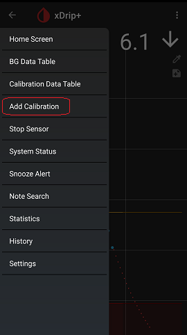

## Calibration  
[xDrip](../README.md) >> [Features](./Features_page) >> [Calibration](./Calibration)  
  
### What is Calibration  
The current continuous glucose monitoring (CGM) technology is limited to measuring glucose in interstitial fluid.  But, the glucose level in blood is not the same as the glucose level in interstitial fluid.  Fortunately, they are correlated.  A formula is used to calculate blood glucose from the measured interstitial fluid glucose.  
  
The CGM measures the interstitial fluid glucose.  We calibrate, by telling the CGM what our blood glucose is, after measuring it using our blood glucose meter.    The CGM uses these two figures to formulate the relationship.  
  
If everything was perfect, the more calibrations we performed, the more accurate the formula would become.  
  
### What could affect overall accuracy  
* The accuracy of your blood glucose meter  
* The accuracy and sensitivity of the sensor  
* The accuracy of the formula  
 

### Delay  
The blood glucose is the cause.  The interstitial fluid glucose is the effect.  The blood glucose is not always constant.  There is a delay (about 15 minutes) from when the blood glucose changes until the interstitial fluid glucose changes accordingly. This delay complicates the matter.  You can see a good description [here](https://www.youtube.com/watch?v=vylZB-m22Sc).  
If your blood glucose is rapidly increasing, or decreasing, what your CGM shows will be very different than what your blood glucose is at the time.  
Therefore, you should never calibrate when the glucose is changing rapidly.  If you do, you could actually degrade accuracy instead of improving it.  

### Factory-calibrated CGM  
G6 offers factory calibration, which means the user does not need to perform calibrations anymore after entering a 4-digit calibration code when starting the sensor.  However, this is based on studies that have minimized the average error.  Some individuals may be farther from the average.   G6 allows you to calibrate if you need to.  
Regardless, it is a good idea to test with your blood glucose meter if your symptoms disagree with what the CGM shows.  

### When to test your blood glucose  
Just because you test your blood glucose with your meter doesn't mean you have to calibrate.  You should test whenever your symptoms disagree with what the CGM shows.  

### When to calibrate  
If you use a G5, you should calibrate twice a day.  
If you use a G6, you don't have to calibrate.  But, if you find the readings to be incorrect, you can calibrate.  

Avoid calibrating when the glucose is changing rapidly.  Ideally, you should only calibrate when the trend is flat.  If you are using G5 or if you use the no-code mode for a G6, you will need to enter initial calibrations.  You don't have readings when you need to enter initial calibrations.  So, how would you know if your trend is flat?  You can ignore this requirement in this case only.  You can use your statistics AGP graph to see what time of day you have less rapid variations and start your sensor such that 2 hours after coincides with it.  This may not always be possible.  But, if it is, it helps accuracy.
  
### How to calibrate  
You can calibrate by taping on "Add Calibration" under the top left menu.  
  
