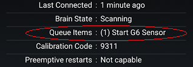

## Clear Transmitter Queue  
  
If you have a command in the [queue](./Transmitter-Queue.md) (G5/G6 status page) that should not be there now, you can clear the queue.  
  

For example, if you don't have connectivity and there is a start sensor command in the queue, you should clear it.  Otherwise, after the connection is established, even if it is temporary, the command may go through.  

To clear the queue, tap on the syringe symbol on the main screen.  
  

Long press (hold your finger on it instead of tapping on it) the microphone symbol at the bottom right corner of the form.  
  
   

Enter the following phrase into the form.  
clear transmitter queue  
