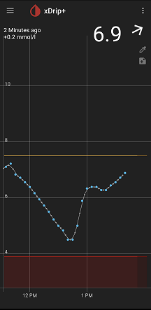

## Connect the dots!  
[xDrip](../README.md) >> [Features](./Features_page.md) >> [Display](./Display/Display.md) >> [Connect the dots](./Connect-the-dots.md)  &nbsp; &nbsp; &nbsp;  
  
Do you want the reading dots on the graph to be connected together with a line?  
If yes, enable the following setting:  
Settings &#8722;> xDrip+ Display Settings &#8722;> Graph Settings &#8722;> Create missing filtered  
  
  
