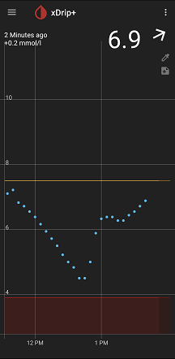

##   
[xDrip](../README.md) >> [Features](./Features_page.md) >> [Display](./Display/Display.md) >> Connect the dots  
  
Do you not like to see the xDrip reading dots in the graph connected together with a line?  
  
  
If no, disable the following setting:  
`Settings` &#8722;> `xDrip+ Display Settings` &#8722;> `Graph Settings` &#8722;> `Create missing filtered`  
  
