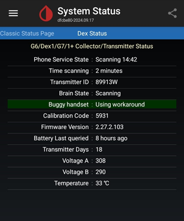

# Dexcom G6 or One Connectivity troubleshooting
[xDrip](../) >> [Features](Features_page.md) >> [Dexcom](./Dexcom_page.md) >> Dexcom G6 Connectivity troubleshooting  
  
* Start with [recommended settings](./G6-Recommended-Settings.md).  
  
* Disable [engineering mode](./Engineering-Mode.md).  
  
* Allow time for changes to take effect.  Communication with the transmitter occurs every 5 minutes.  After making changes, wait for a new reading cycle to complete before assessing the impact on the status page.  
  
* Ensure the transmitter is [activated](./Dexcom/NewG6TX_Activation.md).   
  
* Ensure no other mobile device is set to collect data from the same transmitter. If another device is connected as a master, disconnect it.  
  
* Check the Dex Status Page, which provides important information about the system’s performance.  
  
   
  
* If there is a command in the queue, it should clear in the next read cycle (every 5 minutes). If not, [clear the queue](./Clear-queue.md).  
  
* If the status page shows “Deep sleeping errors” or “Checking Auth errors” and the last connected time is consistently less than 5 minutes, tap “Forget Device” on the classic status page.  
Return to the Dex status page and approve a new pair request. For Android versions older than 10, you will not receive a pair request but will hear a pairing notification.  
  
* If there is still a disconnect, [trigger a pair request](./MissedPairRequest.md).  It should connect.  
  
* If  there is no disconnect, and the status page shows "OK \*\* days" for sensor status, but you have no readings, ensure the xDrip session is started.  Tap “Start Sensor” for G6/Dexcom One; you can enter the same calibration code shown on the status page. The calibration code entered now does not affect the already started session on G6.  
  
* If there is still a disconnect, [disable collection](./Stop-xDrip.md) in xDrip, instasll the Dexcom app, and follow its instructions to start.  If it does not work, you can contact Dexcom for advice.  If it works with Dexcom app, please [report it to us](./Contact.md).  
  
* If your system is functioning but occasionally disconnects and requires action to reconnect, refer to the additional troubleshooting steps for [intermittent connectivity issues](./Intermittent.md).  
  
If you’re still experiencing trouble, don’t hesitate to [ask for help](./Contact.md).  
  
  
