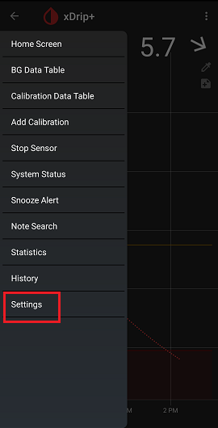
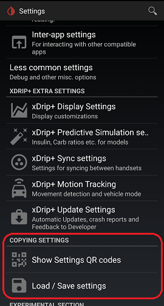

## Copying settings  
[xDrip](../README.md) >> [Settings](./Setting.md) >> Copying settings  
  
To save or copy settings use `Show Settings QR codes` or `Load/Save settings` under xDrip `Settings` from the main menu.  
  
  
  
  
If what you want is to transfer all the history of your readings, you will need to [transnfer the database](./New-Phone.md).  But, be very careful that there is no way to import the database.  xDrip can only replace the database.  
  
If you use `Load/Save settings` and save settings on the original phone, the settings file will be saved in `Internal storage` &#8722;> `Download` &#8722;> `xDrip-export` &#8722;> `com.eveningoutpost.dexdrip_preferences.xml`, on the original phone.  You will need to transfer this file to the destination phone and place it in the same folder.  You can email it to yourself, use a USB cable and use a computer or transfer it to the cloud and to the destination phone.  

If you use the QR code, on the destination phone, you can use `Settings` &#8722;> `Auto configure` from the main menu to scan the QR code.  
  
If you experience any problems transferring the settings using the QR code, please [report it](./Contact.md).  
  
  
