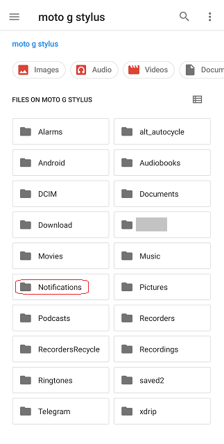
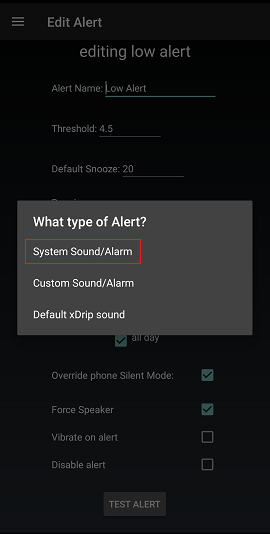

## Custom Alert Sound  
[xDrip](../README.md) >> [Features](./Features_page) >> [xDrip Alerts](./Alerts_page) >> [Custom Alert Sound](./Custom-Alert-Sound)  
  
The issue described below is now resolved.  As long as you use an xDrip release of September 1, 2022 or newer, you will be able to select a custom sound file regardless of where on your phone the file is located.      
  
---  
  
Place your mp3 sound file in the Notifications folder on your internal storage.  If the folder does not exist, create one.  
  
You need to know the title of the sound clip, which may be different than the filename.  In order to know the sound clip title, play it using a music player on your phone.  
  
When you use the xDrip menu to look for a sound file, choose System Sound/Alarm.  
  
  
You will see the mp3 file (the sound clip title) you placed in the Notifications folder, as well as the existing system sound files.  If you choose your mp3 file, it will be used when the alert triggers.  
