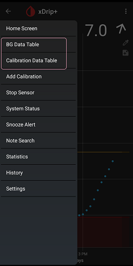

## Datatables  
  
To enable Datatables, enable Settings &#8722;> Less common settings &#8722;> Show Datatables.  
  
Now, if you go back to the main screen and tap on the top left menu button (3 horizontal lines), you will see two new options, "BG Data Table" and "Calibration Data Table".  
  
    
  
Tapping on either, lets you see the corresponding samples that xDrip uses to form the graphs you see on screen.  
