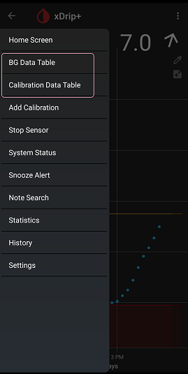

  
# Data tables
[xDrip](../) >> [Features](./Features_page.md) >> Data tables  
  
To enable Data tables, enable `Settings` &#8722;> `Less common settings` &#8722;> `Show Data Tables`.  
  
Once enabled, return to the main screen and tap the menu button (three horizontal lines) in the top left corner. You will now see two new options: `BG Data Table` and `Calibration Data Table`.  
  
    
  
Tapping on either option will display the corresponding data samples that xDrip uses to generate the graphs shown on the screen.  

  
