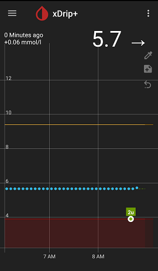
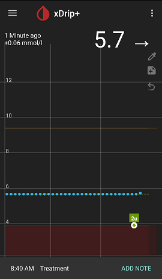
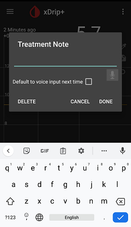

## Delete Treatment  
  
July 8, 2022  
  
Let's say you have entered a treatment (insulin, carb, or blood glucose measurement) and can see it on screen as shown in the following figure.  
  
  
If you want to delete this treatment, tap on it.  
For a short time, a note will appear at the bottom of the screen, with "ADD Note" on the right side, as shown below.  
  
  
Before the notedisappears, tap on "ADD Note".  This will open the keaypad allowing you to add a note as shown below.  
  
