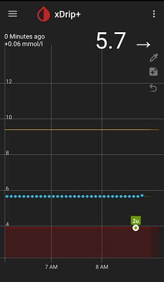
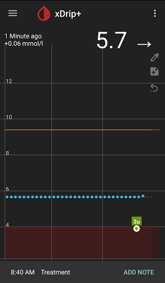
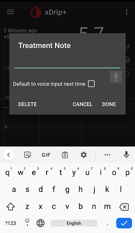

## Delete Treatment
[xDrip](../README.md) >> [FAQ](./FAQ_page.md) >> Delete xDrip treatment  
  
If you’ve entered a treatment (such as insulin, carbs, or a blood glucose measurement) and it appears on the screen (e.g., insulin in this case), follow these steps to delete it:  
  
   
  
1- Tap on the treatment.  
A note will briefly appear at the bottom of the screen with the option `ADD Note` on the right, as shown below.   
  
   
  
2- Tap on `ADD Note`.  
Before the note disappears, tap `ADD Note`. This will open the keypad, allowing you to add a note, as illustrated below.  
  
   
  
3- Tap on `DELETE`.  
To delete the treatment, tap `DELETE`.  

  
