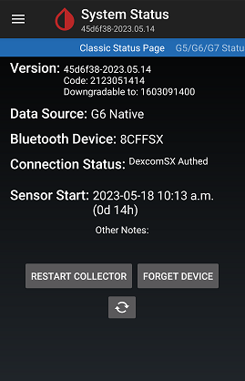

## Dexcom Basics

### Transmitter Expiry
When you receive a new transmitter, pay attention to the dates printed on the box. The first date is the date of manufacture. The second date is either a Ship-By or a Use-By Date.  

If the Ship-By or Use-By date is passed, you should not accept the transmitter. It would be like receiving a box of insulin with a passed expiry date.  
In addition, the warranty is valid only if you start using the transmitter less than 5 months from the date it was sent to you.

Don't establish connectivity to a transmitter unless you intend to use it. As soon as you connect to a new transmitter, even if you don't start a sensor on it, an internal counter starts counting the number of days. You cannot stop it. The last day you can start, or restart, a sensor in native mode is day 99 for a G6 and day 105 for a G5.  
 
  
### Uninstall Dexcom app
You cannot have both xDrip and Dexcom app (or modified Dexcom app) receiving directly from the same transmitter at the same time. You can use one or the other.

If you want to use xDrip, you should ideally uninstall the Dexcom app first. If you need to use both, only the Dexcom app can be a collector and xDrip must be a follower.  
 

### Phone Time Accuracy
Sync your phone clock to the network (Android Settings -> System -> Date & Time).  
  
If you don't, the transmitter could malfunction and it will not be easy to figure out why.  
 

### Battery Optimization
Disable battery optimization of xDrip in Android.  
Generally, this is at Android settings -> Apps -> xDrip+ -> Advanced -> Battery.  
  

However, depending on device and Android version, you may need to look elsewhere or disable more than one item. It's best to search online for how to disable battery optimization on your device.  
 

### Bluetooth Battery Optimization
Disable Bluetooth battery optimization in Android.  
Generally, to access this setting, you should go to Android Settings -> Apps & notifications.  
Tap on "See all apps" if needed to see a list.  Tap on the "Show system apps" from the 3 dot menu.  
Scroll down to Bluetooth and tap on Bluetooth -> Advanced -> Battery.  Disable battery optimization.  
  

### Location and Bluetooth
In Android, you should have Location and Bluetooth active. If you put your phone in Airplane mode, you need to enable Bluetooth if you want xDrip to continue to work.

For Android 11, you should enable background location access.  
Android Settings -> App Settings -> xDrip -> Location  
Choose "Allow all the time".  
  
 

### Don't initiate Android pair
Don't attempt to pair your transmitter from Android Bluetooth settings page. Allow xDrip to trigger an Android pair request. Give permission when requested.

Don't look under the list of paired devices expecting to see your transmitter. The transmitter only transmits a short burst once every 5 minutes. Most of the time, the transmitter is silent. Therefore, Android may show your transmitter as something that was, rather than is, paired.  
 

### System Status
Access the System Status page from the top left menu. There, you can swipe left and right to access two different system status pages, when collecting from a Dexcom transmitter, with headings "Classic Status Page" and "G5/G6 Status".  

The Classic Status page shows the xDrip version including date.  
  

The G5/G6 Status Page contains important parameters including transmitter ID, time from last connection, firmware version, number of days on the transmitter, and transmitter battery voltages.  
  
 

### Connectivity
xDrip will not work if there is no [proper connectivity](./Proper-connectivity.md).  

If there is no proper connectivity, you should not start a sensor. Neither should you attempt to perform a hard reset, calibrate, or stop sensor. You need to first solve the connectivity issue. Most likely, your xDrip settings are incorrect.  
 
