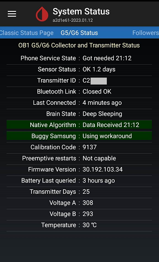

## Dexcom One  
[xDrip](../README.md) >> [Features](./Features_page.md) >> [xDrip & Dexcom](./Dexcom_page.md) >> Dexcom One    
  
If you are using Dexcom One and want to use xDrip as a collector, make sure to at least use the latest [Stable](./Updates.md) release of xDrip.  
  
Under [Hardware Data Source](./HardwareDataSource.md), choose "G5/G6/G7/1 Transmitter".  
Follow all guides, recommendations and instructions written for "G6" [here](./Dexcom_page.md).  
  
  
  
  
