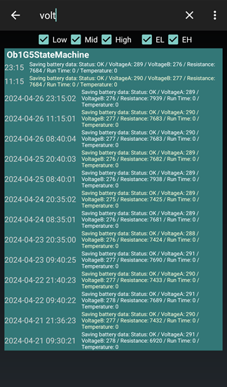

## Battery voltage logs  
[xDrip](../../README.md) >> [Features](../Features_page.md) >> [xDrip & Dexcom](../Dexcom_page.md) >> Battery voltage logs  
  
If you use xDrip as a collector, the battery voltages are saved, and kept for 9 days, in the [logs](./Logs.md).  To see those, while viewing the logs, you can tap on the magnifying glass symbol to search and search for volt.  
That only shows the battery voltage logs.  An example is shown here:  
  
  
Pay attentions to the dates and times on the left.  The items at the top are more recent.  

Voltage B is what matters.  If the value has been decreasing rapidly, it could be that the battery is the cause of connectivity issues you may be experiencing.   
  
