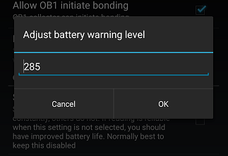

## G6 battery voltage warning
[xDrip](../../README.md) >> [Features](../Features_page.md) >> [xDrip & Dexcom](../Dexcom_page.md) >> G7 voltage warning  
  
You can adjust the voltage level that xDrip provides a warning for.  
To do that, go to Settings &#8722;> G5/G6/Dex1 Debug Settings &#8722;> Adjust battery warning level  
  
  
For a G6, it is safe to set it to 285.  
  
