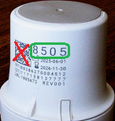
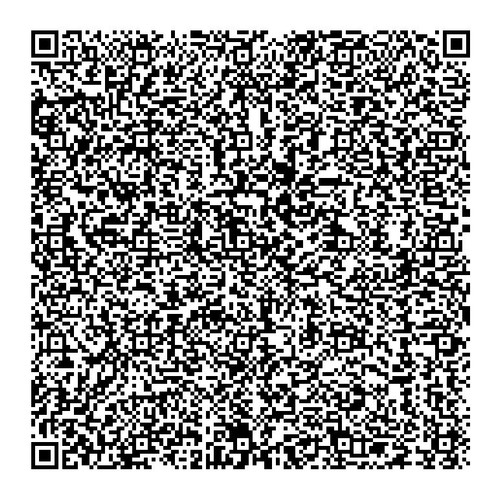
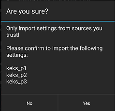
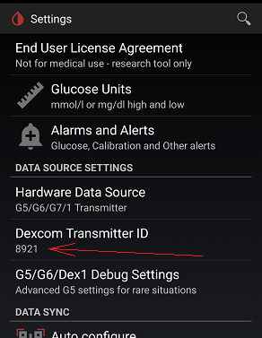

## G7, One+ or Stelo  
[xDrip](../../README.md) >> [Features](../Features_page.md) >> [xDrip & Dexcom](../Dexcom_page.md) >> Dexcom G7, One+ or Stelo  
  
This is how you can use xDrip to collect directly from G7, One+, or Stelo.  
   
  
---  
  
#### **Starting (inserting) the sensor**  
Before inserting a new sensor, use a pen to mark the old one to avoid accidentally removing the wrong sensor later.  
  
While checking that the sensor is not [damaged](./G7ApplicatorFailures.md), follow the manufacturer’s instructions for using the applicator to insert the sensor.
The session will start automatically once the sensor is inserted. There is [no need to manually stop or start](./WhyNoG7Stop.md) anything.  
  
Take note of the 4-digit pairing code displayed on the sensor applicator, as you will need it to establish connectivity later.  
  
   
  
---  
  
#### **Establishing Connectivity**  
  
1- If you have the Dexcom app (or any other app collecting from the sensor) installed, uninstall it.  If you have a Dexcom receiver or t:slim pump, don't start them yet.  If you have already, disable them and wait 15 minutes.  
  
2- Go to Android Settings &#8722;> Connected devices.  
Forget all devices whose names are DXCM\*\*,  DX01\*\* or DX02\*\*, where \*\* could be any two characters.  
  
3- Ensure xDrip is updated to at least the stable release.  
[How to Update](../Updates.md)  
  
4- [Scan the QR code](../Settings/Scan_QR_Code.md) shown below if you haven't already.  This step is required only once, not for every sensor.  
  
  
You should see a message like this:  
  
Approve importing the settings.  
   
  
5- Set up xDrip, and your phone, as explained [here](../G6-Recommended-Settings.md).  It is crucial to review and confirm all settings, as the QR code does not automatically configure them.  
  
6- Ensure your old G7 or One+ devices are out of range or place them inside the microwave.  If you have your old sensor working, that's OK as long as it is connected to another xDrip.  If you have already decided to stop using your old sensor and have disconnected from it, you should peel it off and move it away.  
  
7-  Enter the 4-digit pairing code from the sensor applicator as the transmitter ID.  
  
   
  
8- Go to the [Dex status page](../StatusG5G6.md), and wait for connection.  
Approve the pairing request you will receive if you are using Android 10 or newer.  
  
If you see "Deep Sleeping errors", it may help to restart the phone.  
   
  
If you inserted the sensor more than 30 minutes ago, you will see readings.  If you have just inserted the sensor, you will see warmup.  
Over time, the status page will populate with other data elements, time remaining etc.  
   
  
---  
  
#### **[Troubleshooting](./G7_Troubleshooting.md)**  
   

---  

#### [Applicator failures](./G7ApplicatorFailures.md)
#### [Starting a subsequent G7 or One+](./SubsequentG7.md)  
#### [Why no start or stop](./WhyNoG7Stop.md)
#### [Grace period](./G7_Grace.md)
  
