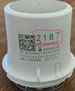

## G7 or One+  
[xDrip](../../README.md) >> [Features](../Features_page.md) >> [xDrip & Dexcom](../Dexcom_page.md) >> Dexcom G7 or One+  
  
This is how you can use xDrip to collect directly from a G7 or One+.  
   
  
---  
  
#### **Start a G7 or One+ (inserting the sensor)**  
Before inserting a new sensor, use a marker to mark your old one to make sure you won't possibly peel off the wrong sensor when the time comes.  
  
While verifying that the sensor is not [damaged](./G7ApplicatorFailures.md), follow the the manufacturer's instructions to use the applicator to insert the sensor.  The session, on G7 or One+, will automatically start upon inserting the sensor.  There is [no need to stop or start](./WhyNoG7Stop.md) anything.  
  
Take note of the 4-digit pairing code shown on the sensor applicator as you will need it when establishing connectivity.  
  
   
  
---  

#### **Establish connectivity to G7 or One+**  
  
1- If you have the Dexcom app (or any other app collecting from G7 or One+) installed, uninstall it.  Having a Dexcom receiver is OK and you don't need to disable it.  
  
2- Go to Android Settings &#8722;> Connected devices.  
Forget all devices whose names are DXCM\*\* or DX02\*\* where \*\* could be any two characters.  
  
3- Please update xDrip to at least the [June 1, 2024 release](https://github.com/NightscoutFoundation/xDrip/releases/tag/2024.06.01).  
[How to Update](../Updates.md)  
  
4- Use `Settings` &#8722;> `Auto configure` to scan the QR code shown below if you haven't already.  You don't need to do this for every sensor.  
  
It may help if you rotate the phone to be in landscape mode after you tap on auto configure, while scanning.  Also, you may need to move the phone back a little bit from the QR code if scanning from a large screen computer.  
  
You should see a message like this:  
  
Approve importing the settings.  
   
  
5- Set up xDrip, and your phone, as explained [here](../G6-Recommended-Settings.md).  It is very important to go over the settings and confirm they are all correct.  The QR code you scanned does not do that.  
  
6- Make sure your old used G7 or One+ devices are out of range, or place them inside the microwave.  This is not necessary.  But, it will speed up pairing.  
  
7- Enter the 4-digit pairing code shown on the sensor applicator as the transmitter id.  
  
   
  
8- Go to the [G5/G6/G7 status page](../StatusG5G6.md), and wait for connection.  
Approve the pairing request you will receive if you are using Android 10 or newer.  
   
  
If you inserted the sensor more than 30 minutes ago, you will see readings.  If you have just inserted a sensor, you will see warmup.  
Over time, the status page will populate with other data elements, time remaining etc.  
   
  
---  
  
#### **Troubleshooting**    
If you see "Mismatch" on the status page, it means either your pairing code is wrong or there is another sensor nearby. Check that pairing code is correct and wait for connection.  
   

---  

#### [Applicator failures](./G7ApplicatorFailures.md)
#### [Starting a subsequent G7 or One+](./SubsequentG7.md)  
#### [Why no start or stop](./WhyNoG7Stop.md)
#### [Grace period](./G7_Grace.md)
  
