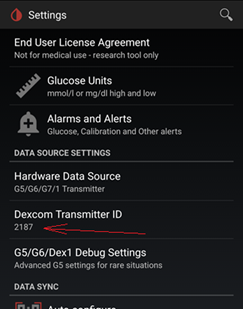

## G7
[xDrip](../../README.md) >> [Features](../Features_page.md) >> [xDrip & Dexcom](../Dexcom_page.md) >> Dexcom G7  
  
This is how you can use xDrip to collect directly from a G7.  
   
  
1- If you have the Dexcom app installed, uninstall it.  
   
  
2- You need the current stable release of xDrip.  If there has been any new firmware release since, which you can verify by looking at the [release notes](../ReleaseNotes.md), you will need to update xDrip to the Nightly release containing the update.    
  
How to [Update](../Updates.md)  
   
  
3- Use `Settings` &#8722;> `Auto configure` to scan the QR code shown below.  
  
  
You should see a message like this:  
  
  
If you don't see such a message, please do not approve loading any settings.  Please stop and inform us.  
If you see the expected message, please approve loading the settings.  
   
  
4- Insert the sensor.  Take note of the 4-digit pairing code shown on the sensor applicator.  
  
   
  
5- Set up xDrip, and your phone, as explained [here](../G6-Recommended-Settings.md).  It is very important to go over the settings and confirm they are all correct.  The QR code you scanned does not do that.  
   
  
6- Make sure your old used G7 devices are out of range, or place them inside the microwave.  This is not necessary.  But, it will speed up pairing.  
   
  
7- Enter the 4-digit pairing code shown on the sensor applicator as the transmitter id.  
  
   
  
8- Go to the [G5/G6/G7 status page](../StatusG5G6.md), and wait for connection.  
Approve the pairing request you will receive if you are using Android 10 or newer.  
   
   

---  
  
If you inserted the sensor more than 30 minutes ago, you will see readings.  If you have just inserted a sensor, you will see warmup.  
  
If you see "Mismatch" on the status page, it means either your pairing code is wrong or there is another sensor nearby. Check that pairing code is correct and wait for connection.  
Over time, the status page will populate with other data elements, time remaining etc.  
  
