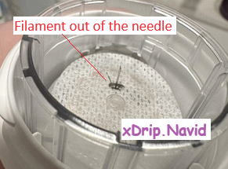

## G7 or One+  
[xDrip](../../README.md) >> [Features](../Features_page.md) >> [xDrip & Dexcom](../Dexcom_page.md) >> Dexcom G7 or One+  
  
This is how you can use xDrip to collect directly from a G7 or One+.  
   
  
---  
  
#### **Start a G7 or One+ (inserting the sensor)**  
Before inserting a new sensor, use a marker to mark your old one to make sure you won't possibly peel off the wrong sensor when the time comes.  
  
All you need to do to start a G7, or One+, is to follow the manufacturer's instructions to use the applicator to insert the sensor.  The session will automatically start upon inserting the sensor.  
  
However, after you remove the cap and before using the applicator to insert, look inside.  If you see no adhesive or if you see the filament outside the needle, as shown in the following two images, the sensor is damaged.  
    
Don't apply.  Contact Dexcom.  You can take a picture to show them if needed.  Use another sensor.  
  
Take note of the 4-digit pairing code shown on the sensor applicator as you will need it when establishing connectivity.  
  
   

---  

#### **Establish connectivity to G7 or One+**  
  
1- If you have the Dexcom app (or any other app collecting from G7 or One+) installed, uninstall it.  Having a Dexcom receiver is OK and you don't need to disable it.  
  
2- Go to Android Settings &#8722;> Connected devices.  
Forget all devices whose names are DXCM\*\* or DX02\*\* where \*\* could be any two characters.  
  
3- Please update xDrip to the March 27, 2024 release.  
[How to Update](../Updates.md)  
  
4- Use `Settings` &#8722;> `Auto configure` to scan the QR code shown below if you haven't already.  
  
You don't need to do this for every sensor.  
  
You should see a message like this:  
  
  
Approve importing the settings.  
   
  
5- Set up xDrip, and your phone, as explained [here](../G6-Recommended-Settings.md).  It is very important to go over the settings and confirm they are all correct.  The QR code you scanned does not do that.  
  
6- Make sure your old used G7 or One+ devices are out of range, or place them inside the microwave.  This is not necessary.  But, it will speed up pairing.  
  
7- Enter the 4-digit pairing code shown on the sensor applicator as the transmitter id.  
  
   
  
8- Go to the [G5/G6/G7 status page](../StatusG5G6.md), and wait for connection.  
Approve the pairing request you will receive if you are using Android 10 or newer.  
   

9- Check under the main menu (main screen top left corner).  If an option to start sensor is available, tap on it to start.  
   
  
If you inserted the sensor more than 30 minutes ago, you will see readings.  If you have just inserted a sensor, you will see warmup.  
Over time, the status page will populate with other data elements, time remaining etc.  
   
  
---  

#### **Starting a subsequent G7 or One+**  
This is the recommended approach for starting your next device after you have been using one already.  
  
When the status page shows 10 days for transmitter days, or after the optional sensor expiry note on the main screen shows that the sensor will expire in about 12 hours, insert a new sensor following the section above titled "Start a G7 or One+".  
  
  
You can use a phone, other than your main xDrip phone, to establish connectivity to your new device to confirm that it is working.  To do that, follow the instructions under the heading "Establish connectivity to G7 or One+" above using the other phone.  
After you have confirmed that it is working, you can just [disconnect](../Stop-xDrip.md).  There is no requirement to maintain connectivity for the sensor to remain operational.  
  
When your current sensor stops working after its 10.5 day period ends, or before, proceed with the following.  
  
1- If you haven't disabled the test phone, do it now.  You can [disable collection](../Stop-xDrip.md) on it.  
2- On your main phone, follow the instructions under the heading "Establish connectivity to G7 or One+" above to connect to your new device using the pairing code of your new G7.  
3- Peel off the old sensor being careful not to accidentally peel off the new one.  
   
  
You don't have to wait for your current sensor to reach day 10 to insert a new one.  If you need to, you can start your next sensor when your current sensor still has less than 10 days on it.  In that case, the overlap between the two sensors will be more than 12 hours.  
If you have 10 sensors and you overlap each for 12 hours, you will get 100.5 days from them.  But, if you overlap them by 1.5 days each, you will only get 91.5 days from the 10 sensors instead of 100.5.  
   
  
---  
  
#### **Troubleshooting**    
If you see "Mismatch" on the status page, it means either your pairing code is wrong or there is another sensor nearby. Check that pairing code is correct and wait for connection.  
  
