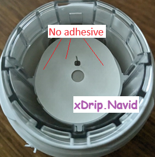

## xDrip G7 applicator failures  
[xDrip](../../README.md) >> [Features](../Features_page.md) >> [xDrip & Dexcom](../Dexcom_page.md) >> G7 applicator failures  
  
After you remove the applicator cap, look inside.  If you see no adhesive or if you see the filament outside the needle, as shown in the following two images, the sensor will not work.  
  
  
Don't apply.  Contact Dexcom.  You can take a picture to show them if needed.  Use another sensor.  
  
After you use the applicator and insert the device, if you can see the filament as shown in the following image, it means that it has not been inserted under your skin.  You should take a picture.  
  
After you have connectivity, it is almost certain you will have no readings.  When you contact Dexcom, you can use the picture you took to show what has  gone wrong.  
   
  
---  
  
