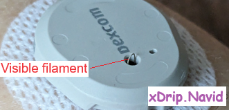

## G7 applicator failures  
[xDrip](../../README.md) >> [Features](../Features_page.md) >> [xDrip & Dexcom](../Dexcom_page.md) >> G7 applicator failures  
  
Read the instructions for using the applicator but do not follow them yet.  
After removing the cap, look inside the applicator. If you see no adhesive or if the filament is outside the needle, as shown in the images below, the sensor will not work.  
  
  
Do not apply the sensor. Contact Dexcom for support. If necessary, take a picture of the applicator to show them. Use a different sensor.  
   

If there are no visible defects, follow the manufacturer’s instructions to insert the sensor.  
  
After using the applicator and inserting the sensor, if you can see the filament (as shown in the image below), it means the filament has not been properly inserted under your skin. Take a picture showing the visible filament.  
  
After you have connectivity, it is almost certain you will have no readings.  In that case, use the picture you took to illustrate the problem when contacting Dexcom.  
  
Use a different sensor.  

  
