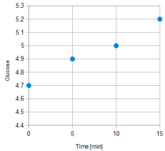
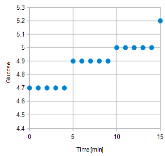
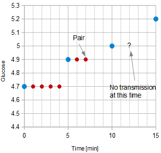

## G7 Rapid Reconnect  
[xDrip](../../README.md) >> [Features](../Features_page.md) >> [xDrip & Dexcom](../Dexcom_page.md) >> Dexcom G7 once a minute scan  
  
A G7 (or One+) device transmits data every 5 minutes under normal conditions.  
The following image shows an example.  
  
  
The communication between a G7 and an app is two-way, involving an acknowledgment mechanism.  
If a G7 device misses three consecutive acknowledgments (15 minutes), it switches to a rapid reconnect mode, transmitting every reading 4 more times once per minute to facilitate faster reconnection. This mode continues for up to 12 hours or until the app successfully reconnects.  
The following image provides an example:  
.  
  
As soon as a handhsake takes place, G7 stops the additional transmissions.  There is no way for xDrip to know which transmission is the original once-every-5-minute transmission and which is not.  Therefore, it is possible that xDrip could pair and handshake on one of the additional transmissions.  The problem in that case is that when xDrip wakes up 5 minutes after, there will be no G7 transmission as shown in the next figure.  
  
  
  
