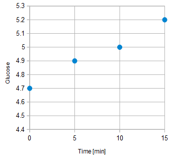
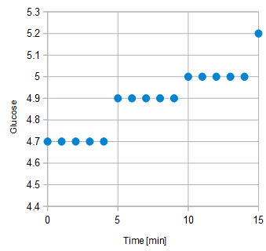
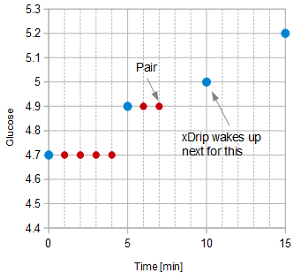

# G7 Rapid Reconnect  
[xDrip](../../) >> [Features](../Features_page.md) >> [xDrip & Dexcom](../Dexcom_page.md) >> Dexcom G7 once a minute scan  
  
A G7 (or One+) device transmits data every 5 minutes under normal conditions.  
The following image shows an example:  
  
   
  
The communication between a G7 device and an app is two-way, utilizing an acknowledgment mechanism. If a G7 device misses three consecutive acknowledgments (15 minutes), it switches to a rapid reconnect mode. In this mode, the device transmits each reading 4 additional times—once per minute—to facilitate faster reconnection. This mode continues for up to 12 hours or until the app successfully reconnects.  
The following image provides an example:  
.  
   
  
As soon as a handshake occurs, the G7 stops the additional transmissions.  xDrip gets the timestamp from the reading.  The timestamp corresponds to the once every 5 minute sequence. As a result, when xDrip pairs and handshakes with one of the additional transmissions, it wakes up correctly for the next once every 5 minute sequence, as illustrated in the next figure.  
    
  
